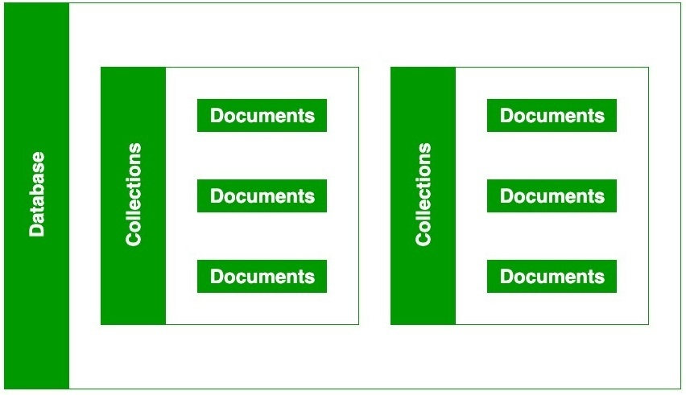
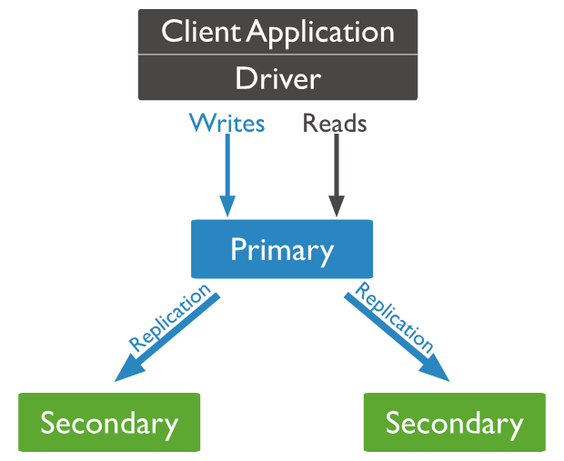
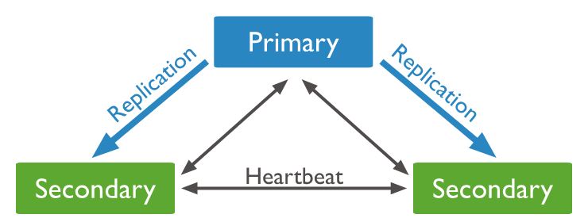
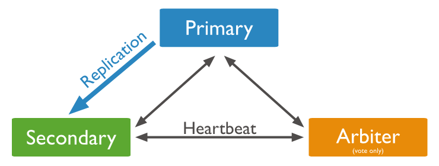
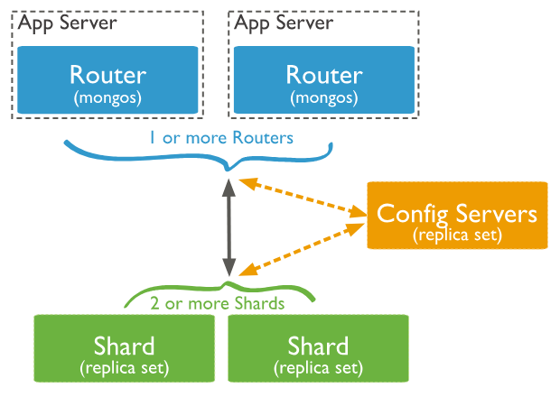

# MongoDB

## What is MongoDB?
MongoDB is a powerful, flexible, and scalable NoSQL database that provides high performance and real-time data processing.

### What is NoSQL 
NoSQL is a non-relational or distributed database system that supports non-structured and semi-structured datasets. Not limited to SQL (Structured Query Language), it offers accessible horizontal scaling and dynamic schema for unstructured data.

## What are collections and documents?
In MongoDB, data is stored inside documents that are inside collections. 


| Component  | Description                              |
|------------|------------------------------------------|
| Database   | Stores multiple collection               |
| Collection | Groups related documents (Table)         |
| Document   | A BSON Object containing key value pairs |
| Field      | Stores data attributes within documents  |

**Example of a document in a collection**
```BSON
{
  "name": "David",
  "course": "Data Engineering",
  "trainer": {
    "name": "Luke",
    "expertise": "Data"
  }
}
```
**Exemple of a collection**
```BSON
[
  {
    _id: ObjectId("64c9a7f2d4a3f5b8c1234567"),
    name: "David",
    course: "Data Engineering",
    trainer: { name: "Luke", expertise: "Data" }
  },
  {
    _id: ObjectId("64c9a7f2d4a3f5b8c1234568"),
    name: "Sarah",
    course: "Machine Learning",
    trainer: { name: "Emma", expertise: "AI" }
  },
  {
    _id: ObjectId("64c9a7f2d4a3f5b8c1234569"),
    name: "John",
    course: "Cloud Computing",
    trainer: { name: "Mark", expertise: "AWS" }
  }
]
```
## MongoDB Architecture
### What are Replica Sets?
A replica set is a group of **mongod** instance that maintain the same data set. A **mongod** is a daemon process handling data requests, managing data access and performing background management operations. 
It contains: 
- Several data bearing nodes : **Only** one primary and the rest secondary
- (optional) Arbiter node

A replica set node only belongs to one replica set.

The primary node is in charge of the writing operations and all the changes to the data sets. This is then written in the operation log. The secondary replicates the primary's operation log then applying these operation to its version of the data to have the same data as the primary.

An arbiter is a mongod that vote during election but doesn't have data. An election is when nodes decide which of them can become primary.

An arbiter will always stay and arbiter whereas a primary may step down a be a secondary. 

#### Advantage and Disadvantage?
| Feature                  | Advantages                                            | Disadvantages                                         |
|-------------------------|------------------------------------------------------|-----------------------------------------------------|
| High Availability      | Automatic failover keeps the system online            | Requires at least 3 nodes, increasing cost          |
| Data Redundancy        | Multiple copies protect against data loss             | Consumes more storage across nodes                  |
| Read Scalability       | Secondary nodes can handle read queries               | Reads may be stale due to replication lag           |
| Automatic Failover     | No manual intervention needed                         | Frequent elections can disrupt performance          |
| Backup Support         | Backups can run on secondaries, reducing primary load | Added complexity in managing nodes   
### What is Sharding?
Sharding is a method for distributing data across multiple machines. MongoDB uses sharding to support deployments with very large data sets and high throughput operations.
To scale a system, there are 2 methods possible : 
- Horizontal scaling
- Vertical Scaling

Sharding is the act of scaling horizontally. 

Sharding devides a large collection into smaller chucks and distributes them across multiple servers also named **shards**.  Sharding can be summurize in 2 technologies:
- A **shard key**: 
  - determines how documents are partitioned 
  - makes sure that each shard holds a portion of the data
- A config server:
  - maintains metadata about which shards stores which data
  - a mongos router directing client queries to the correct shard
#### Advantage and Disadvantage?
| Feature                | Advantages                                                   | Disadvantages                                              |
|------------------------|-------------------------------------------------------------|-----------------------------------------------------------|
| Horizontal Scalability | Handles very large datasets by distributing them across shards | Increased complexity in setup, monitoring, and maintenance |
| Performance            | Spreads read/write load, improving throughput                | Requires careful shard key selection; poor choice can cause data imbalance |
| Storage Capacity       | Each shard stores part of the data, increasing overall capacity | Joins and aggregations across shards can be slower        |
| Availability           | With proper replica sets per shard, provides redundancy      | More nodes mean higher operational costs                  |
| Flexibility            | Can grow cluster by adding shards without downtime          | Migration and balancing operations may affect performance |
| Query Parallelism      | Can execute queries in parallel across shards               | Some queries may need to target all shards (scatter-gather), reducing speed |

## MongoDB Use Cases?
On a social media app with a user profile a SQL database may not be the best choice for multiple reason: 
1. Need of a flexible schema: Not everyone has the same thing on their profile. One may have a bio, another may not have a profile picture. The need for specific settings for each user. 
2. Need to add new feature without having to overhaul the whole system to adapt to the new schema
3. Embedding other documents like posts
4. Horizontal scaling
5. 
**Example of a User profile page as a document:**
```BSON
{
  "_id": "user1",
  "username": "data504",
  "email": "coolguy@example.com",
  "bio": "Loves hiking and tech.",
  "followers": ["user2", "user4"],

  "posts": [
    {
      "post_id": "post001",
      "content": " sparta global",
      "likes": 0,
      "comments": [
        { "user": "user4", "comment": "Data Engineering" }
      ]
    }
  ]
}

```

